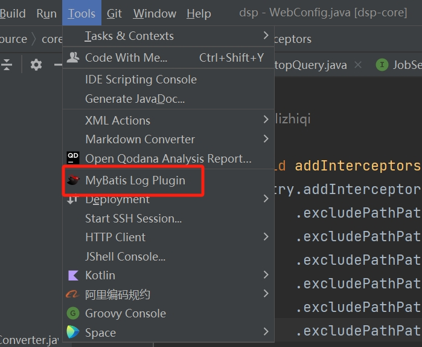
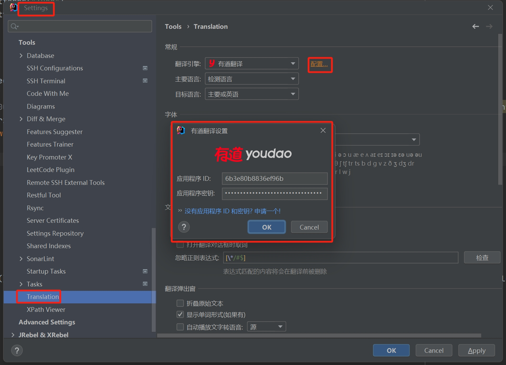

# idea插件

### 1.GenerateAllSetter 

一键调用一个对象的所有的set方法,get方法等
在方法上生成两个对象的转换

使用方法参考github连接：https://github.com/gejun123456/intellij-generateAllSetMethod

### 2.JRebel and XRebel  

热部署和性能分析插件  修改完代码，无需重启服务  联调接口时特别方便

### 3.Key Promoter X  

快捷键提示插件

### 4.LeetCode Editror 

力扣刷题插件

### 5.Maven Helper 

maven依赖分析插件

### 6.MyBatis Log Free    

mybatis sql打印插件

使用方法:

点击 Tool -> MyBatis Log Free
点击 MyBatis Log Free in the console

### 7.MybatisX   

mapper and xml互相跳转

### 8.RestfulTool  

API接口定位和测试插件

一套 Restful 服务开发辅助工具集
提供了一个 Services tree 的显示窗口
双击 URL 直接跳转到对应的方法定义
一个简单的 http 请求工具
支持 Spring 体系 (Spring MVC / Spring Boot)
支持 JAX-RS
支持 `Navigate -> Request Service` 搜索 Mapping (Ctrl + Alt + /)

### 9.SonarLint 

代码质量审查插件

### 10.Alibaba Java Coding Guidelines 

p3c扫描插件

### 11.Translation翻译插件

网络环境如果不能连上google,需要在idea里面配置一下有道翻译或百度翻译的id和密匙

配置路径

Settings-->Tools-->Translation-->配置

### 12.Rainbow Brackets

彩虹括号

### 13.String Manipulation

字符串操作

### 14.Chinese (Simplified) Language Pack

官方汉化插件包